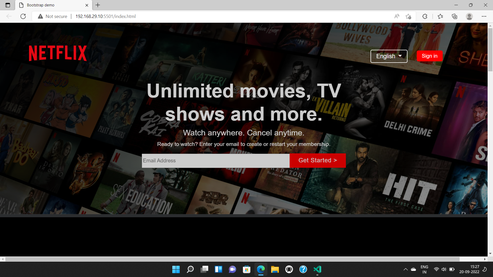
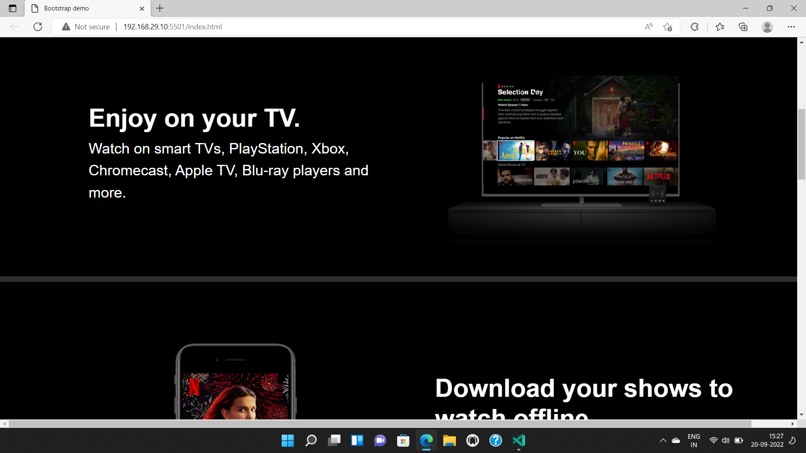
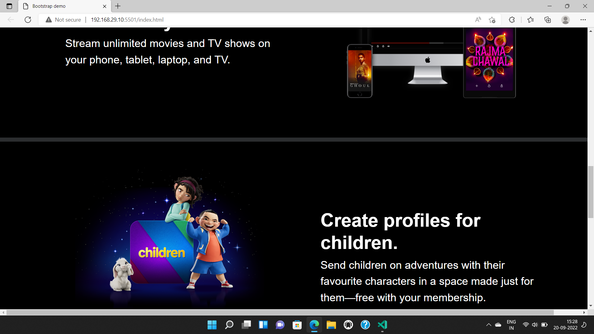
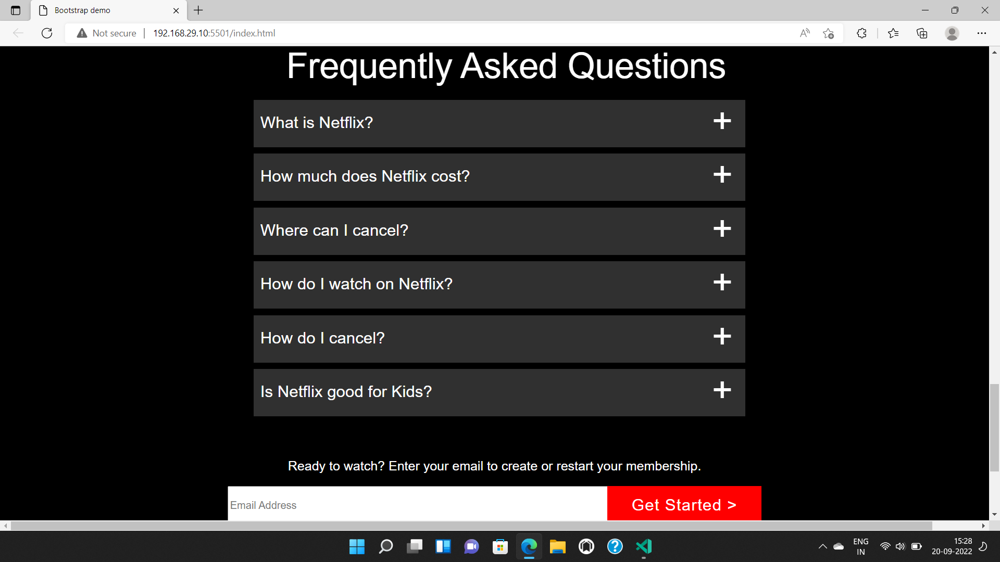
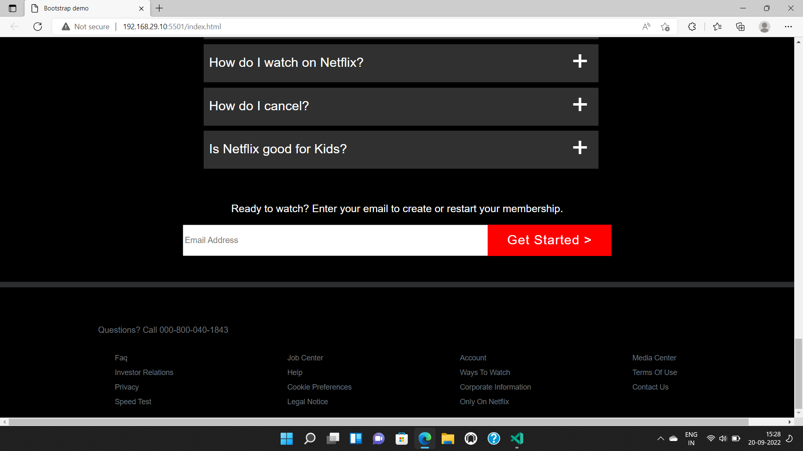

# Netflix Project

 

## Project live link
[#](# "project01")

## Screenshot

 

## project Type
- UI Design
- One Page Website

## My learning from this Project
- How to design HTML Code
- Button Designing
- Hover effect
- Videos
- Position
- Gradients

## Honest time to make this project
#### Approx 2 hour to make this project